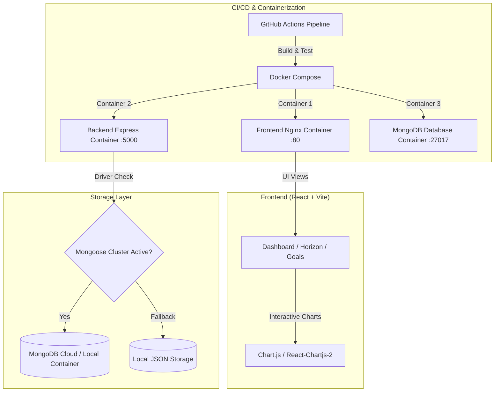

# FinFlow | Premium Full-Stack Expense & Wealth Management Platform

FinFlow is a resilient, enterprise-grade financial management platform built on the **MERN (MongoDB, Express, React, Node.js)** stack. It features real-time financial health analytics, auto-debit subscription tracking, interactive compound wealth forecasting (**FinFlow Horizon**), multi-stage **Docker containerization**, and automated **GitHub Actions CI/CD pipelines**.

---

## 🚀 Key Technical Highlights (Resume & Placement Ready)

- **🐳 Multi-Stage Docker Containerization**: Fully containerized using Nginx-served multi-stage builds for the React frontend, Node.js Alpine base images for the API backend, and automated container orchestration via `docker-compose.yml`.
- **⚡ Automated GitHub Actions CI/CD Pipeline**: Configured `.github/workflows/ci-cd.yml` to automatically execute dependency checks, React production bundle compilation, and Docker image builds on every push to `main`.
- **🌅 FinFlow Horizon Predictive Engine**: Built an interactive compound wealth growth simulator allowing users to project 1-Year, 3-Year, 5-Year, and 10-Year compounding horizons based on monthly savings, expected returns, and expense cuts.
- **🛡️ Resilient Hybrid Storage Engine**: Architected a custom fail-safe database connection system that dynamically tests local/cloud MongoDB connectivity (with a 2s timeout) and automatically falls back to local JSON flat-file storage when database clusters are unreachable, ensuring **100% uptime**.
- **📊 Interactive Financial Analytics & AI Health Index**: Integrated Chart.js time-series trend lines, category distribution doughnut charts, and a real-time Financial Health Advisor (0-100 score).
- **📅 Auto-Debit Subscriptions Tracker**: Engineered a recurring billing tracker that aggregates fixed monthly auto-debits (normalizing yearly fees) and renders a color-coded upcoming payment timeline with dynamic alerts.
- **📄 1-Click CSV Statement Exporter**: Client-side CSV encoder enabling instant, custom-filtered financial data exports.

---

## 🛠️ Architecture & Tech Stack



- **Frontend**: React.js (Vite), Chart.js, Lucide Icons, Glassmorphic CSS
- **Backend**: Node.js, Express.js, Cors, Dotenv
- **DevOps & Cloud**: Docker, Docker Compose, Nginx, GitHub Actions CI/CD
- **Deployment**: Live on **Vercel** (Frontend) and **Render** (Backend)
- **Database / Storage**: MongoDB (Mongoose ODM) & Local File System (JSON Flat-files)

---

## 🐳 Running with Docker (One-Command Setup)

You can launch the entire stack (Frontend, Backend, and MongoDB Database) with a single command:

```bash
# 1. Clone the repository
git clone https://github.com/harshil2709/FinFlow.git
cd FinFlow

# 2. Build and launch all Docker containers
docker compose up --build
```

- **Frontend SPA**: `http://localhost`
- **Express Backend API**: `http://localhost:5000/api`
- **MongoDB**: `localhost:27017`

---

## 📋 API Specifications

All endpoints are prefixed with `/api`.

### Transactions API
| Endpoint | Method | Description |
| :--- | :--- | :--- |
| `/expenses` | `GET` | Fetches filtered transactions |
| `/expenses` | `POST` | Creates a new transaction |
| `/expenses/:id` | `PUT` | Updates an existing transaction |
| `/expenses/:id` | `DELETE`| Deletes a transaction |

### Savings Goals API
| Endpoint | Method | Description |
| :--- | :--- | :--- |
| `/goals` | `GET` | Fetches user savings goals |
| `/goals` | `POST` | Creates a new savings goal |
| `/goals/:id` | `PUT` | Updates goal current deposit amount |
| `/goals/:id` | `DELETE`| Removes a savings goal |

### Subscriptions & Budgets API
| Endpoint | Method | Description |
| :--- | :--- | :--- |
| `/subscriptions` | `GET` / `POST` / `PUT` / `DELETE` | Auto-debit subscription management |
| `/budgets` | `GET` / `POST` / `DELETE` | Category budget limit management |

---

## 🏃‍♂️ Manual Local Setup (Without Docker)

### 1. Backend Setup
```bash
cd backend
npm install
npm run dev
```

### 2. Frontend Setup
```bash
cd frontend
npm install
npm run dev
```
Open `http://localhost:5173` in your browser.
